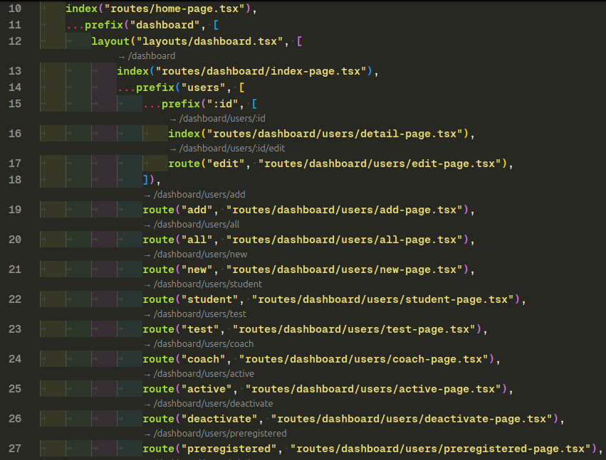

# RRR - Routes-React-Router

🔗 Links

- [Open VSX](https://open-vsx.org/extension/enBonnet/routes-react-router)
- [Marketplace](https://marketplace.visualstudio.com/items?itemName=enbonnet.routes-react-router)

📍 Route Annotator for React Router
Route Annotator is a VSCode extension that adds helpful annotations to your routes.ts files when working with react-router. It displays clickable CodeLens links above each route or index declaration, showing the full path derived from nested prefix() and route() structures.

🛠 Features:

Automatically detects route paths in routes.ts files.

Resolves full paths for nested prefix() + route() and index() definitions.

Adds a CodeLens above each route showing its full URL path.

Clicking the annotation copies the full route path to your clipboard instantly.

Works seamlessly with file-based TypeScript route configs using react-router conventions.

✅ Screenshot:

🔧 Usage:
Just open a routes.ts file in your project — CodeLens annotations will automatically appear if the file matches the pattern and language.